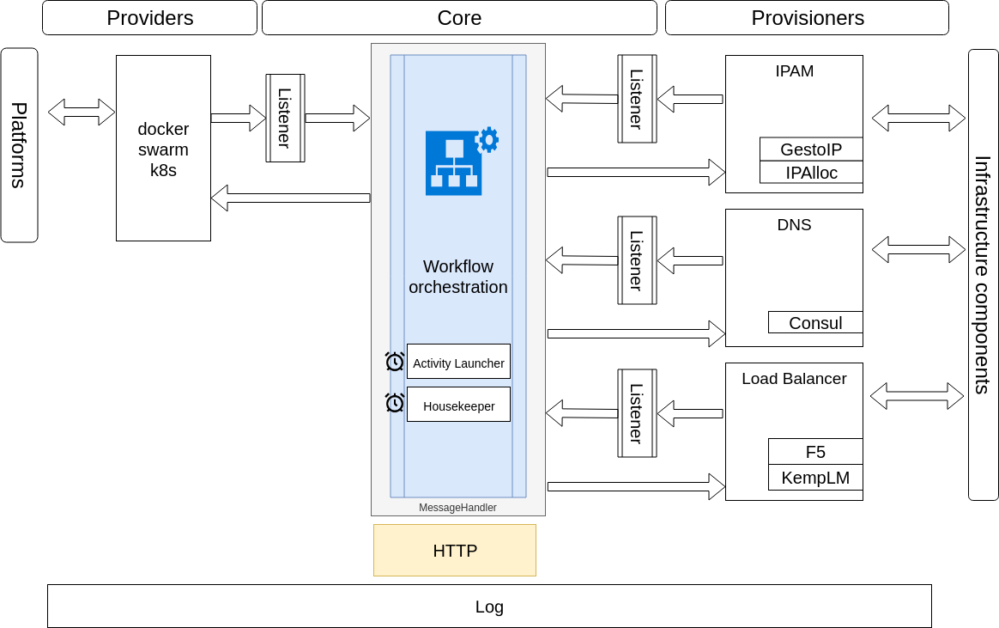

# interlook

Dynamically provision (V)IP, Load Balancer configuration and DNS alias for services deployed on containers platforms.

## TL;DR

Interlook has a concept of "Providers" and "Provisioners", orchestrated by the "core".

Providers are connected to the containers platform and are responsible for detecting service deployment or deletion.

Provisioners are responsible for interacting with infra components like DNS server, IPAM tools and load balancers/reverse proxies.

The core receives add/delete events from the providers, injects them as workflow entry with a target state ("deployed" or "undeployed"). 

Then it ensures the relevant tasks are performed by the different "provisioners" (as defined in the workflow) to bring the service to the desired state.

## Configuration

Interlook uses a yaml formatted configuration file. 

The file contains different sections:

* core:

Configure interlook's core module
 
```yaml
core:
  logLevel: DEBUG
  listenPort: 8080
  logFile : stdout
  # workflowSteps: comma separated succession of extenstions
  workflowSteps: provider.swarm,ipam.ipalloc,lb.f5ltm
  # where the workflow entries are saved
  workflowEntriesFile: ./share/flowentries.db
  # how often should the workflow controller run
  workflowActivityLauncherInterval: 3s
  # how often should the workflow housekeeper run
  workflowHousekeeperInterval: 60s
  # close the entry in error if work in progress for longer than
  serviceWIPTimeout: 90s
  # remove entries that have been closed for time
  cleanUndeployedServiceAfter: 10m
  # trigger a refresh request to provider if service has not been updated since
  serviceMaxLastUpdated: 90s
``` 

The other sections configure the `provider` and the `provisioners`. Each component has its own configuration. Refer to the `extension` implementation in the component package. For example for `ipalloc` refer to the package in provisioner\ipam\ipalloc.

* `provider`

```yaml
provider:
  swarm:
    endpoint: tcp://ucp.csnet.me:443
    labelSelector:
      - l7aas
    tlsCa: /path/to/ca.pem
    tlsCert: /path/to/cert.pem
    tlsKey: /path/to/key.pem
    pollInterval: 5s
```

* `ipam`

```yaml
ipam:
  ipalloc:
    network_cidr: 192.168.99.0/24
    db_file: ./share/conf/allocated.db
```


* `dns`
```yaml
dns:
  consul:
    url: http://127.0.0.1:8500
    domain:
    token:
```

* `lb`

```yaml
lb:
  kemplm:
    endpoint: https://192.168.99.2
    username: api
    password: apiPassw0rd
    httpPort:
    httpsPort:
```

## Architecture

Technically, providers and provisioners are all implementations of the Extension interface.




Currently supported Providers:
 * ~~Docker~~
 * Docker Swarm (not tested yet)
 * Docker Enterprise (Swarm)
 * ~~Consul Catalog~~

Currently supported Provisioners:
 * IP:
    * ipalloc (an embedded simple local IPAM)
    * ~~GestioIP~~
 * DNS:
    * Consul (DNS records will contain Consul specific suffix: .service._consul-domain_, use CoreDNS with rewrite)
 * Load Balancer:
    * Kemp LoadMaster
    * F5 Big-IP LTM

## Doc

[Interlook's workflow](./docs/WORKFLOW.md)

[IPAlloc](./docs/IPALLOC.md)

[Extension](./docs/EXTENSION.md)

## Authors

Boris HUISGEN <bhuisgen@hbis.fr>

Michael CHAMPAGNE <mch1307@gmail.com>
