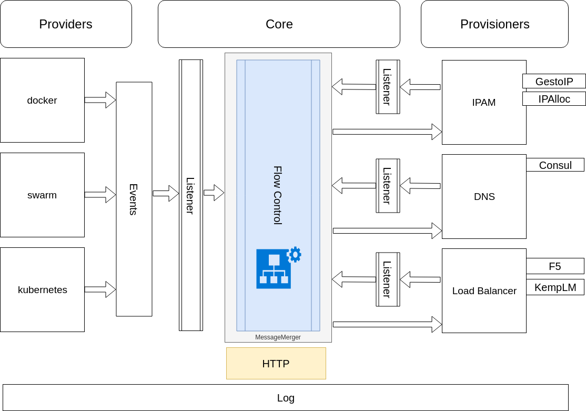

# interlook

Dynamically provision (V)IP, Load Balancer configuration and DNS alias for services deployed on containers platforms.

## TL;DR

Interlook has a concept of "Providers" and "Provisioners", orchestrated by the "core".

Providers are connected to the containers platform and are responsible for detecting service deployment or deletion.

Provisioners are responsible for configuring infra components like DNS server, IPAM tools and load balancers/reverse proxies.

The core receives add/delete events from the providers, injects them as workflow entry with a target state ("deployed" or "undeployed"). 

Then it ensures the relevant tasks are performed by the different "provisioners" (as defined in the workflow) to bring the service to the desired state.

## Configuration

Interlook uses a yaml formatted configuration file. 

The file contains different sections:

* core:

Configure interlook's core module
 
```yaml
core:
  logLevel: DEBUG
  listenPort: 8080
  logFile : stdout
  workflow: provider.docker,ipam.ipalloc,dns.consul,lb.kemplm
  checkFlowInterval: 5s
  flowEntriesFile: ./share/flowentries.db
``` 

The other sections configure the `provider` and the `provisioners`. Each component has its own configuration. Refer to the `extension` implementation in the component package. For example for `ipalloc` refer to the package in provisioner\ipam\ipalloc.

* `provider`

```yaml
provider:
  docker:
    name: myDocker
    endpoint: tcp://docker.net:443
    labelSelector:
      - interlook.host
    tlsCa: path/to/ca
    tlsCert: path/to/cert
    tlsKey: path/to/key
    Watch: true
    WatchInterval: 10s
    updateInterval: 15s
```

* `ipam`

```yaml
ipam:
  ipalloc:
    network_cidr: 192.168.99.0/24
    db_file: ./share/conf/allocated.db
```


* `dns`
```yaml
dns:
  consul:
    url: http://127.0.0.1:8500
    domain:
    token:
```

* `lb`

```yaml
lb:
  kemplm:
    endpoint: https://192.168.99.2
    username: api
    password: apiPassw0rd
    httpPort:
    httpsPort:
```

## Architecture

Technically, providers and provisioners are all implementations of the Extension interface.




Currently supported Providers:
 * ~~Docker~~
 * ~~Docker Swarm~~
 * ~~Docker Enterprise Edition~~
 * ~~Consul Catalog~~

Currently supported Provisioners:
 * IP:
    * [ipalloc](./provisioner/ipam/ipalloc/README.md) (an embedded simple local IPAM)
    * ~~GestioIP~~
 * DNS:
    * Consul (DNS records will contain Consul specific suffix: .service._consul-domain_ )
 * Load Balancer:
    * Kemp LoadMaster
    * ~~F5 Big-IP~~ 

## Doc

[Interlook's workflow](./WORKFLOW.md)

## Authors

Boris HUISGEN <bhuisgen@hbis.fr>

Michael Champagne <mch1307@gmail.com>
