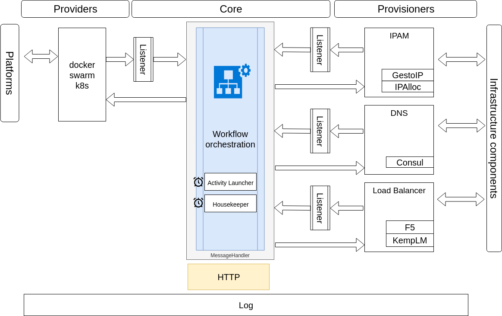

# Architecture

Technically, providers and provisioners are all implementations of the Extension interface.

Currently supported Providers:

- [x] Docker Swarm (Docker Enterprise, CE not tested yet)

Currently supported Provisioners:

 * IP:
    - [x] ipalloc (an embedded simple local IPAM)
    - [ ] GestioIP
 * DNS:
    - [x] Consul (DNS records will contain Consul specific suffix: .service._consul-domain_, use CoreDNS with rewrite)
 * Load Balancer:
    - [x] Kemp LoadMaster
    - [x] F5 Big-IP LTM
